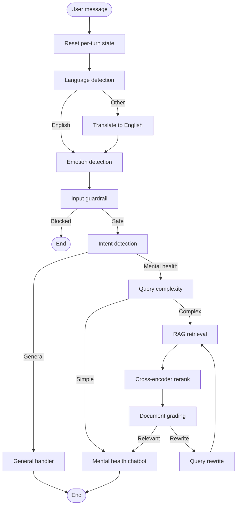

# Serenity

**Serenity** is a modular NLP and agent-orchestration toolkit built around a multilingual mental-health support assistant. It combines classical ML classifiers, hybrid retrieval-augmented generation (RAG), a **Qwen2.5 model fine-tuned with DPO on mental-health preference data**, and a LangGraph pipeline exposed through a FastAPI streaming chat UI.

> **Note:** Serenity is a research and educational prototype. It is not a substitute for professional mental health care. If you or someone you know is in crisis, contact local emergency services or a qualified crisis line.

---

## Overview

At runtime, user messages flow through a directed graph of specialized nodes: language detection and translation, emotion inference, safety guardrails, intent routing, optional RAG retrieval with reranking and relevance grading, and finally LLM-based response generation. Pipeline progress is streamed to the browser via Server-Sent Events (SSE).

The same graph can be exercised from the CLI (`agents/graph.py`) or through the web app (`main.py`).

---

## Architecture



---

## Features

| Area | Capabilities |
|------|----------------|
| **Orchestration** | LangGraph `StateGraph` with per-turn state reset and in-memory conversation checkpoints |
| **Preprocessing** | FastText language ID (176 languages), seq2seq translation to English, fine-tuned Albert emotion classifier |
| **Safety** | LLM-based input guardrail for obvious injection, jailbreak, hate, and harm patterns |
| **Routing** | Few-shot intent classification; complexity routing (comfort vs. factual/clinical queries) |
| **RAG** | Pinecone hybrid search (dense embeddings + BM25 sparse), cross-encoder reranking, relevance grading, query rewrite loop |
| **Generation** | Groq-hosted chat model for production inference; optional local **Qwen2.5-0.5B-Instruct DPO** checkpoint for domain-aligned replies |
| **Interface** | FastAPI + SSE streaming; minimal chat UI with live pipeline status (`templates/`, `static/`) |
| **Research** | Jupyter notebooks for emotion, language ID, intent, RAG indexing, and DPO training (`Qwen_DPO_Training.ipynb`) |

---

## Tech Stack

- **API:** FastAPI, Uvicorn, Jinja2
- **Agents:** LangGraph, LangChain
- **Models:** PyTorch, Transformers, Sentence Transformers, FastText
- **Vector store:** Pinecone (`pinecone`, `pinecone-text`)
- **LLM inference:** LangChain Groq (`langchain-groq`), Hugging Face Transformers + TRL (DPO training)
- **DPO fine-tuning:** [Qwen2.5-0.5B-Instruct](https://huggingface.co/Qwen/Qwen2.5-0.5B-Instruct) aligned on [mrs83/kurtis_mental_health_dpo](https://huggingface.co/datasets/mrs83/kurtis_mental_health_dpo)

---

## Language model (Qwen DPO)

Serenity includes a **mental-health–aligned chat model** produced by Direct Preference Optimization (DPO). Training is documented end-to-end in `notebooks/Qwen_DPO_Training.ipynb`.

| Item | Detail |
|------|--------|
| **Base model** | `Qwen/Qwen2.5-0.5B-Instruct` |
| **Training method** | TRL `DPOTrainer` (`beta=0.1`, early stopping on `eval_loss`) |
| **Dataset** | [`mrs83/kurtis_mental_health_dpo`](https://huggingface.co/datasets/mrs83/kurtis_mental_health_dpo) — ~2,800 prompt / chosen / rejected triples for empathetic vs. harmful responses |
| **Saved weights** | `checkpoints/Qwen2.5-0.5B-Instruct-DPO/checkpoint-1185` (best epoch checkpoint; gitignored) |
| **Runtime loader** | `ml/llm.py` → `get_dpo_model()` / `get_chat_dpo_local()` |

The DPO objective teaches the model to prefer **chosen** counselor-style answers over **rejected** harmful or dismissive ones (each row may include `rejected_notes` explaining why the rejected reply is unsafe).

**Production vs. local model**

- The live agent graph (`agents/nodes/generation.py`, routing, guardrails) currently calls **`get_groq_model()`** for low-latency API inference.
- To use the fine-tuned checkpoint instead, swap imports in the relevant nodes to `get_dpo_model()` from `ml/llm.py` (requires a CUDA GPU and the checkpoint on disk).

**Reproduce training**

```bash
jupyter lab notebooks/Qwen_DPO_Training.ipynb
```

Set `HF_API_KEY` (or `huggingface-cli login`) to download the dataset and base weights. After training, copy the best checkpoint folder into `checkpoints/` and set `DPO_CHECKPOINT` in `.env` if your path differs from the default in `core/config.py`.

---

## Prerequisites

- **Python** 3.10+ (3.11 recommended)
- **GPU** optional but recommended for emotion inference (`cuda` used when available)
- **API keys:** Groq (required for chat, routing, guardrails, intent) and Pinecone (required for RAG)
- **Model artifacts:** Local checkpoints under `checkpoints/` (not tracked in git; see [Model artifacts](#model-artifacts))

---

## Installation

### 1. Clone and create a virtual environment

```bash
git clone <repository-url>
cd Serenity
python -m venv .venv
```

**Windows (PowerShell):**

```powershell
.\.venv\Scripts\Activate.ps1
```

**macOS / Linux:**

```bash
source .venv/bin/activate
```

### 2. Install dependencies

```bash
pip install -r requirements.txt
```

### 3. Configure environment variables

Copy the example file and fill in your keys:

```bash
cp .env.example .env
```

| Variable | Required | Description |
|----------|----------|-------------|
| `GROQ_API_KEY` | Yes | Powers intent, guardrails, complexity routing, and chat generation |
| `PINECONE_API_KEY` | Yes (RAG path) | Pinecone index access for hybrid retrieval |
| `PINECONE_INDEX_NAME` | No | Defaults to `mental-health` (`core/config.py`) |
| `HF_API_KEY` | Optional | Hugging Face Inference API (alternate LLM path in `ml/llm.py`) |
| `GEMINI_API_KEY` / `OPENAI_API_KEY` | Optional | Reserved for future integrations |
| `LANGSMITH_*` | Optional | Tracing and observability for LangChain |

Paths to local checkpoints can also be overridden via `.env`; defaults are defined in `core/config.py`.

### 4. Model artifacts

Place trained or downloaded weights under `checkpoints/` (this directory is gitignored). Expected layout:

| Path (default) | Purpose |
|----------------|---------|
| `checkpoints/best_model_albert.pth` | Fine-tuned Albert emotion classifier weights |
| `checkpoints/lid.176.ftz` | FastText language identification model |
| `checkpoints/many_to_one_translator/` | Hugging Face seq2seq translator |
| `checkpoints/dense_encoder_model/` | Sentence-transformer dense encoder |
| `checkpoints/sparse_encoder_model.json` | Fitted BM25 sparse encoder |
| `checkpoints/cross_encoder_model/` | Cross-encoder for reranking |
| `checkpoints/Qwen2.5-0.5B-Instruct-DPO/checkpoint-1185/` | DPO-finetuned Qwen2.5 mental-health chat model (see [Language model](#language-model-qwen-dpo)) |

Update `core/config.py` or `.env` if your filenames differ. Override the DPO path with `DPO_CHECKPOINT` in `.env`.

---

## Running the application

### Web UI (recommended)

```bash
python main.py
```

Open [http://127.0.0.1:8000](http://127.0.0.1:8000). The UI streams pipeline status and the final reply from `POST /chat/stream`.

To change host or port, set `APP_HOST` and `APP_PORT` in `.env` or edit `core/config.py`.

### CLI graph tester

```bash
python -m agents.graph
```

Type messages interactively; type `exit` or `quit` to stop.

### Jupyter experiments

```bash
jupyter lab notebooks/
```

Example notebooks:

- `emotion_classifier.ipynb`, `emotion-roberta.ipynb` — emotion modeling
- `FastText_Language_Identification.ipynb`, `Language_Detection_*.ipynb` — language ID
- `intent_classifier_using_few_shot_learning.ipynb` — intent experiments
- `rag_question_searching.ipynb`, `rag_answer_searching.ipynb`, `graph_and_rag.ipynb` — RAG and graph integration
- `Qwen_DPO_Training.ipynb` — DPO fine-tuning of Qwen2.5 on `kurtis_mental_health_dpo`
- `data_medical.ipynb` — mental health counseling dataset exploration (`Amod/mental_health_counseling_conversations`)

---

## Project structure

```
Serenity/
├── main.py                 # FastAPI app, SSE /chat/stream endpoint
├── agents/
│   ├── graph.py            # LangGraph definition and compilation
│   ├── state.py            # Typed state and Pydantic schemas
│   └── nodes/              # Pipeline nodes (preprocess, guardrails, RAG, generation)
├── core/
│   ├── config.py           # Settings (paths, Pinecone, RAG tuning, API)
│   └── models.py           # API request/response models
├── ml/
│   ├── classifiers.py      # Language, emotion, intent
│   ├── emotion.py          # Albert emotion model
│   ├── translator.py       # Many-to-one translation
│   └── llm.py              # Groq / Hugging Face LLM factories
├── rag/
│   ├── encoders.py         # Dense + sparse encoder loading
│   ├── retriever.py      # Pinecone hybrid retriever setup
│   └── reranker.py         # Cross-encoder reranking
├── notebooks/              # Research and training notebooks
├── templates/              # Chat UI (index.html)
├── static/                 # CSS and client-side SSE handling
└── checkpoints/            # Local model weights (gitignored)
```

---

## Configuration reference

Key tunables in `core/config.py`:

| Setting | Default | Role |
|---------|---------|------|
| `RAG_TOP_K` | 20 | Initial hybrid retrieval count |
| `RERANKER_TOP_K` | 5 | Documents kept after cross-encoder rerank |
| `RELEVANCE_THRESHOLD` | 0.7 | Minimum grader score to proceed without rewrite |
| `MAX_REWRITE_ATTEMPTS` | 2 | Query rewrite iterations before fallback |
| `DEVICE` | `cuda` if available else `cpu` | Emotion model inference device |
| `DPO_CHECKPOINT` | `checkpoints/Qwen2.5-0.5B-Instruct-DPO/checkpoint-1185` | Path to DPO-finetuned Qwen weights |

---

## Extending the pipeline

1. **New node** — Implement a function in `agents/nodes/` that accepts and returns partial `ChatbotState` updates.
2. **Wire the graph** — Register the node and edges in `agents/graph.py` (`build_graph`).
3. **UI feedback** — Emit `status_update` entries from nodes; the frontend maps node names to pipeline steps.

For standalone RAG experiments without the full graph, use `rag/encoders.py`, `rag/retriever.py`, and `rag/reranker.py` directly.

---

## Development

- Format and lint with your preferred tools; the repo does not enforce a specific toolchain.
- When adding checkpoints, place files under `checkpoints/` and align paths in `core/config.py`.
- Keep secrets out of version control; only commit `.env.example` with placeholders.

---

## Contributing

1. Fork the repository and create a feature branch.
2. Add or update notebooks that demonstrate new behavior where applicable.
3. Open a pull request with a clear summary of changes and how to test them.

---


## Acknowledgements

Serenity builds on open-source ecosystems including [LangGraph](https://github.com/langchain-ai/langgraph), [Hugging Face Transformers](https://huggingface.co/docs/transformers), [TRL](https://huggingface.co/docs/trl), [Qwen2.5](https://huggingface.co/Qwen), [Sentence Transformers](https://www.sbert.net/), [FastText](https://fasttext.cc/), and [Pinecone](https://www.pinecone.io/). If you use this work in research, cite the underlying models and datasets (including [`mrs83/kurtis_mental_health_dpo`](https://huggingface.co/datasets/mrs83/kurtis_mental_health_dpo)) according to their respective licenses and papers.

---


